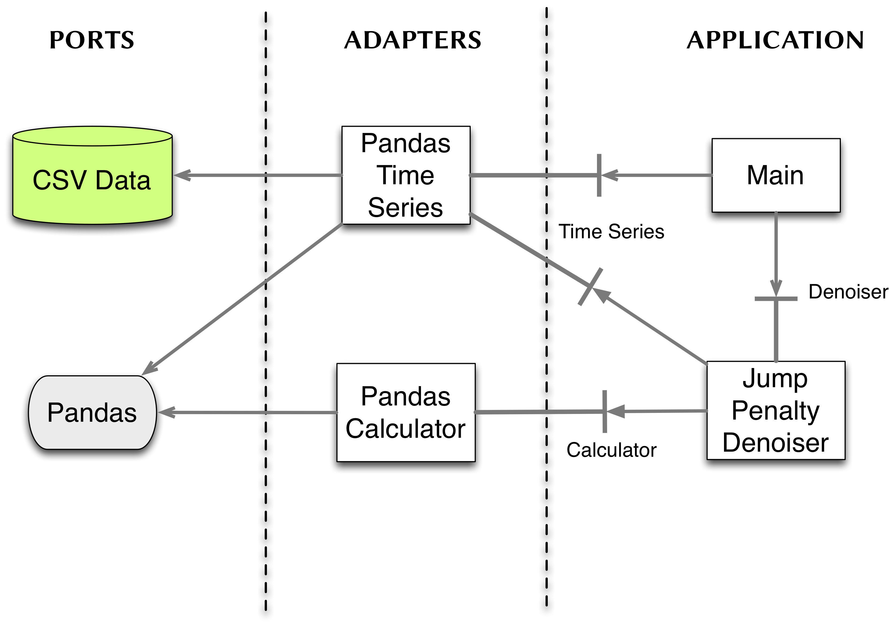

What is calm?
-----------------------

**calm** is a python library for denoising 1D time series.

License information
-------------------

See the file "LICENSE" for information terms & conditions for usage and a DISCLAIMER OF ALL WARRANTIES.

